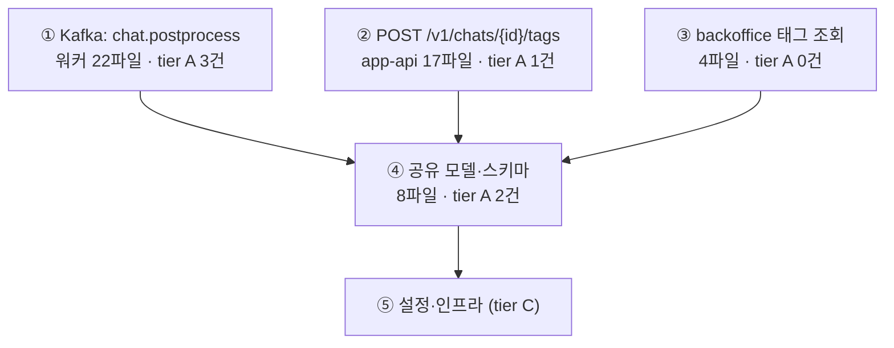
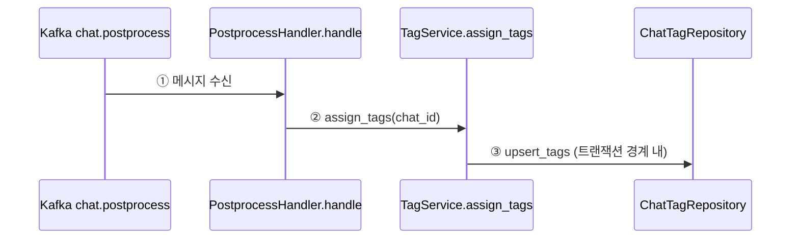
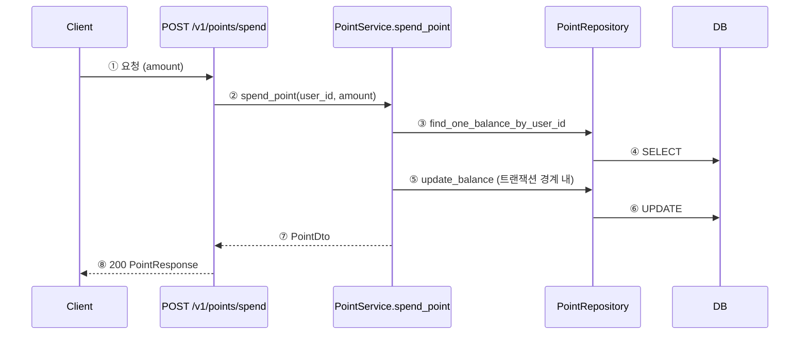

## Change Walkthrough

Reading a diff is fast. **Reconstructing intent from a diff is slow** — where is this called from, why does it exist, does it match the design, what did the implementer decide on the fly. That reconstruction is what makes review expensive, and it cannot be answered by the diff alone.

The answer does **not** go into code comments (comments state *why* in one line; they never carry design rationale — that rots the codebase). It goes here, into a sidecar artifact the reviewer reads alongside the diff.

> **The truth is always the raw diff. This guide is an aid.** It is generated from a specific SHA and goes stale the moment the code moves. Say so, in the artifact, every time.

> MUST invoke `Skill(design-workflow)` before running this skill.

---

### Two modes

|  | **slice mode** (default) | **retrofit mode** (`--retrofit`) |
|---|---|---|
| **When** | The code was written *by* `/impl-pipeline`, slice by slice. | The code was **already written** before the pipeline existed — one bulk implementation, often in a worktree. |
| **Input: what to review** | Slice target globs from the 작업 큐. | The whole working-tree diff vs the base branch. |
| **Input: why it exists** | The decision ledger (`D-n`), via `ledger current`. | A design document (legacy PRD / task doc), cited **by section**. |
| **Input: machine verdict** | `/review-gate` JSON — required. | Usually absent → badges render `미검증`. |
| **Chapters** | One per slice; the slice *is* the unit. | **The skill derives them** — the diff is split by entrypoint-reachable flow. |
| **Headline output** | 판단 필요 N건 (what the gate could not certify). | **미구현 / 설계와 다른 구현 / 설계에 없던 추가** — the design-conformance triage. |
| **Artifact** | `.claude/review/{slug}/S-{n}.md` | `.claude/review/{slug}/retrofit.md` |

Everything else is **shared**: request-flow ordering, graph-derived call chains, the "영향받지만 미수정" warning, risk tiers, the Mermaid rules, the SHA stamp, and the degraded-mode fallbacks. Retrofit is an additional entry path, not a fork of the skill.

- **Slice mode** → Steps 1–5 below.
- **Retrofit mode** → Steps R1–R7 below, which reuse Step 2 (call chain) and Step 4 (tiers) verbatim.

---

### Arguments

```
/change-walkthrough [slice-id] [--all] [--task <task-file>]        # slice mode
/change-walkthrough --retrofit [--design <doc>] [--base <branch>] [--worktree <path>]
```

**Slice mode**
- `slice-id` — e.g. `S-2`. Generates one guide.
- `--all` — generate a guide for every slice in the 작업 큐 that has a gate JSON, plus an `INDEX.md`.
- `--task <task-file>` — ledger task doc. Resolution order: arg → **the gate JSON's `.task_file` field** → `.claude/review/{branch-slug}/context.json` → vault search by branch keyword → ask.

**Retrofit mode**
- `--retrofit` — no slices, no ledger, no gate. Build the guide from the working-tree diff alone.
- `--design <doc>` — the design document. **Repeatable** (`--design A.md --design B.md`). Omitted → search the vault by branch keyword, present the candidates, and **ask** (§ R2). Never silently pick one.
- `--base <branch>` — comparison base. Default: resolve it (§ R1) — never hardcode `dev` or `main`.
- `--worktree <path>` — the target worktree. Default: cwd.

`/impl-pipeline` invokes slice mode without `--task`, so the gate JSON is the normal source. That is why the gate stamps `task_file` into its output. **`/impl-pipeline` never invokes retrofit mode** — retrofit exists precisely for work that never went through the pipeline.

**Slice-mode prerequisite:** `/review-gate {slice-id}` must have run — the guide consumes its JSON. If `.claude/review/{branch-slug}/S-{n}-gate.json` is missing, run the gate first (or, with explicit user consent, proceed with all badges rendered as `미검증`). Retrofit mode has **no such prerequisite** — see § R6 for how badges are handled there.

---

# Part 1 — Slice mode

---

## Step 1 — Gather inputs

```bash
LEDGER="${CLAUDE_PLUGIN_ROOT}/scripts/ledger/ledger"
SLUG=$(git branch --show-current | tr '/' '-')
HEAD_SHA=$(git rev-parse --short HEAD)

# 1. Gate result — badges, user-judgment items, task_file, project, base_branch
cat ".claude/review/$SLUG/S-2-gate.json"

# 2. Decisions this slice owns (never Read the whole task doc)
"$LEDGER" current --file "$TASK" --topic <topic-slug>

# 3. The diff, and the per-file blob hashes for the staleness stamp
#    $BASE comes from the gate JSON's .base_branch (or context.json). Never hardcode it.
git diff "$BASE"...HEAD -- <slice target globs>
git diff --name-only --diff-filter=ACMR "$BASE"...HEAD | \
  xargs -I{} sh -c 'echo "{} $(git hash-object {} | cut -c1-7)"'
```

4. The implementer's report — when invoked from `/impl-pipeline`, the Step 3 slice agent returns any issue, design gap, or unstated assumption it hit while implementing. That text is an input here (it fills the 구현 중 발견된 이슈 chapter). Invoked standalone, that chapter carries only what the gate found.

### Resolve the code-graph project (never hardcode a project name)

Indexed project names are **not** reliably path-derived — some are path-shaped, some are short service
names. Resolve by path, every run:

1. `{PROJECT}` = the gate JSON's `.project` / `context.json`'s `.project`, if set.
2. Otherwise:
   ```
   mcp__codebase-memory-mcp__list_projects()
   ```
   → pick the entry whose `root_path` (or `git.canonical_root`) equals `git rev-parse --show-toplevel`.
   In a worktree, also compare against the main worktree root (`git worktree list | head -1`).
3. **No match → degraded mode.** The repo is not indexed. Do **not** call `index_repository` — it is
   expensive and the user has not consented. Generate the guide without the call chain: skip Step 2,
   drop the mermaid diagram and the 호출됨/호출함/영향 범위 fields, and put this banner at the top of
   the artifact:
   > `⚠️ 코드 그래프 미인덱싱 — 호출 체인 생략. 영향 범위(회귀 위험)는 직접 확인해야 한다.`
   > `이 저장소를 인덱싱하면 호출 체인 Map과 "영향받지만 미수정" 경고를 받을 수 있다.`

   Everything else in the guide is still produced. Degraded ≠ failed.

Then refresh the index so it reflects the new code (only when `{PROJECT}` resolved):

```
mcp__codebase-memory-mcp__detect_changes(project="{PROJECT}", base_branch="{BASE}")
```

`{BASE}` is the base branch from the gate JSON (`origin/dev`, `origin/main`, `develop`, … — resolved,
never assumed). Pass it without the `origin/` prefix if the tool rejects a remote-qualified name.

---

## Step 2 — Build the call chain (graph, never grep)   ⟨SHARED — retrofit reuses this⟩

**Do not grep for callers.** Grep finds strings; it misses dynamic dispatch, DI-injected calls, and inheritance, and it drowns in false hits. Use the graph.

```
# Callers + callees of a changed symbol, with risk labels
mcp__codebase-memory-mcp__trace_path(
    function_name="spend_point",
    project="{PROJECT}",          # ← resolved in Step 1. Never a literal from another repo.
    mode="calls",
    direction="both",
    depth=3,
    risk_labels=true)

# Locate a symbol / confirm its layer when the name is ambiguous
mcp__codebase-memory-mcp__search_graph(
    project="{PROJECT}",
    query="spend point service",
    file_pattern="<the changed file's directory>/**")
```

Note: `risk_labels` classifies by **hop distance** (CRITICAL/HIGH/MEDIUM/LOW), not by fan-in. Derive **fan-in** yourself by counting the inbound callers in the `direction="both"` result.

### Cost control

A graph can hold 20k+ nodes. Tracing everything is wasteful and slow.

**Trace:** changed **public** symbols (entrypoint handlers, public methods of business-logic and
data-access units — whatever the project's layer model calls them), and any symbol the gate flagged.
**Skip:** pure data shapes (DTO/type/schema files), re-export and barrel files, DI/registration files,
generated code, test files.

Cap at **~12 traces per slice**. If a slice has more public symbols than that, trace the entrypoints and the highest fan-in symbols, and note in the guide which symbols were not traced.

### "영향받지만 미수정" — the regression trap

For every changed symbol, take its **inbound callers** from `trace_path`. Any caller that is **not in this diff** is code that will now execute against changed behavior without having been touched.

**This must be surfaced as a warning in the guide.** It is the single highest-value thing the graph gives you and the thing a human is most likely to miss.

```
- **영향 범위**: 이 서비스를 호출하는 기존 코드 3곳 — `PurchaseService.refund()` 포함 (⚠️ 영향받지만 미수정)
```

---

## Step 3 — Order by request flow   ⟨SHARED — retrofit orders *within each chapter* this way⟩

**Not** alphabetical. **Not** git-diff order. Order the chapters the way a request actually travels
through **this project's layer model** — the chain resolved by `/impl-pipeline` Step 0 and carried in
`context.json.layers`:

```
진입점 → (project's intermediate layers, in order) → 데이터 계층
```

<!-- 예시: 프로젝트마다 다르다. 규범이 아니다.
     layered backend : Route/Worker handler/Kafka consumer → Service → Repository → Model/Migration
     frontend        : Page/Route → Component → Hook → API client → Type
     data pipeline   : Trigger/handler → Transform → Sink → Schema
-->

Take the order from the traced call chain, not from a guess. If `context.json.layers` is absent, derive
the order from the call chain itself (entrypoint = the symbol with no inbound caller inside the diff).
If a slice has multiple entrypoints, split into one sub-chapter per flow.

This is the whole point: the reviewer wants to *read along the way the request flows*.

---

## Step 4 — Assign risk tiers   ⟨SHARED — retrofit reuses this⟩

**If the project ships `.claude/review-policy.md`, that file wins.** Read it and use its tiers verbatim.
It is optional — most projects will not have one. Without it, apply the principles below.

### Tier A — 정독 필수 (any one of these)

1. **The domain handles money, permissions, or personal data.** Detect from the path/symbol names in
   the diff (e.g. a `payment` / `billing` / `point` / `auth` / `permission` / `account` segment) and from
   whatever the project's own domain docs call these areas.
2. **Schema migration** — any migration/DDL file, in whatever directory this project keeps them.
3. **Transaction / lock / concurrency boundary changed** — a transactional or locking wrapper added,
   removed, or moved; a critical section widened or narrowed. Detect from the project's own primitives.
4. **High fan-in symbol** — many inbound callers in the `trace_path` result. Changing it moves a lot of
   code that this diff does not touch. (Degraded mode cannot compute this — say so in the guide.)

<!-- 예시: 어떤 레이어드 Python 백엔드에서는 ①이 purchase/point/auth 경로, ②가
     cores/db/alembic/versions/, ③이 @with_transaction / @redis_lock 이었다.
     이것은 그 프로젝트의 사실이지 규범이 아니다. 현재 프로젝트에서 다시 판정하라. -->

### Tier B — 요약 + 스팟체크

Ordinary business logic that none of the tier-A conditions apply to. Full chapter, `[tier B]` badge.

### Tier C — 접힘

Convention-passing boilerplate the machine already certified: pure data shapes, re-exports/barrels,
DI or route registrations, generated code, test scaffolding. Collapsed into a single `<details>` block,
one line each.

Chapters stay in **request-flow order** — tiers are *badges*, not a sort key. Put a `tier A 항목: N건` count at the top of the guide so the reviewer knows the size of the job before reading.

---

## Step 5 — Write the artifact

Path: `.claude/review/{branch-slug}/S-{n}.md`.

If `git check-ignore -q .claude/review` says the path is **not** ignored, add a line to the report telling
the user to keep it out of the commit. Never edit their `.gitignore`.

Delegate generation to a subagent. Give it every input explicitly; it must not go hunting.

```
Agent(subagent_type="general-purpose", description="Write review guide", prompt="""
TASK: Write a Korean-language review guide (검수 가이드) markdown file for one implementation slice.

INPUT 1 — 게이트 결과 JSON:
{contents of .claude/review/{slug}/S-2-gate.json}

INPUT 2 — 담당 결정 (ledger current --topic 출력):
{output}

INPUT 3 — diff:
{git diff {BASE}...HEAD -- <slice globs>}

INPUT 4 — 호출 체인 (codebase-memory trace_path 결과, 심볼별):
{trace results — callers, callees, fan-in counts, which callers are NOT in the diff}
{degraded mode 이면: "코드 그래프 미인덱싱 — 호출 체인 없음"}

INPUT 5 — SHA 스탬프:
  HEAD: a3f9c21
  파일별 blob: <path> <blob>, ...

INPUT 6 — 구현 서브에이전트 리포트 (impl-pipeline Step 3의 REPORT — 구현 중 발견한 이슈 /
  설계 공백 / 암묵 가정. 없으면 "없음"):
{implementer report text}

INPUT 7 — 이 프로젝트의 레이어 순서 (context.json.layers):
{e.g. Route → Service → Repository → Model. 없으면 "INPUT 4의 호출 체인에서 도출하라"}

EXPECTED OUTCOME: write .claude/review/{slug}/S-2.md following the template in
  ~/.claude/skills/change-walkthrough/SKILL.md § 산출물 템플릿. Nothing else.

MUST DO:
  - 챕터를 INPUT 7의 요청 흐름 순서로 배열 (진입점 → … → 데이터 계층)
  - 각 챕터에 tier 배지, 변경/왜(D-n 인용)/호출됨/호출함/배지
  - INPUT 4에서 "diff에 없는 호출자"를 반드시 ⚠️ 영향받지만 미수정 으로 표기
  - degraded mode 이면 상단에 "⚠️ 코드 그래프 미인덱싱 — 호출 체인 생략" 배너, 호출 체인 필드는 생략
  - 게이트의 user_review_items 각각을 "판단 필요" 항목으로 렌더
  - tier C는 <details>로 접기
  - Mermaid 노드 라벨은 원숫자(①②③)로 시작. `1. ` 같은 숫자+마침표+공백 금지
    (Obsidian 파서가 리스트로 오인해 다이어그램이 깨진다). 범위 표기에 틸드(~) 대신 하이픈(-)
  - 상단에 SHA 스탬프와 "진실은 raw diff" 경고 문구

MUST NOT DO:
  - 소스 코드 파일을 수정하거나 코드에 주석을 추가 (정책 위반)
  - git add / git commit / git stash
  - grep으로 호출 관계를 추적 (INPUT 4가 이미 그래프에서 뽑은 진실이다)
  - INPUT에 없는 내용을 추측해서 채우기 — 모르면 "미확인"이라고 쓴다
""")
```

---

# Part 2 — Retrofit mode (`--retrofit`)

The pipeline assumes design → slice → implement → gate → guide. **Retrofit is for code that skipped all
of it**: a bulk implementation, finished before the pipeline existed, that now has to be reviewed. There
are no `S-n`, no `D-n`, and no gate JSON — so this mode manufactures the three things the guide needs
(a unit of reading, a "why", and a verdict) from what *does* exist: the diff, a design document, and the
graph.

The single most valuable output of retrofit is **the design-conformance triage** (§ R5). The reviewer
already knows roughly what they built. What they cannot see from a diff is *what they built that was
never designed*, and *what was designed and never built*.

---

## Step R1 — Resolve the target and collect the diff

A retrofit target is frequently a **git worktree** with zero commits and everything uncommitted. The diff
collection must therefore cover committed *and* uncommitted *and* untracked changes.

```bash
WT="${WORKTREE:-$(pwd)}"                                  # --worktree, else cwd
BRANCH=$(git -C "$WT" branch --show-current)
SLUG=$(echo "$BRANCH" | tr '/' '-')
HEAD_SHA=$(git -C "$WT" rev-parse --short HEAD)
```

**Base branch** — from `--base`; otherwise resolve it, never assume. Take the candidate this branch is
*nearest* to (a branch cut from `dev` is far fewer commits from `dev` than from `main`):

```bash
BASE=$(for C in origin/dev origin/develop origin/main origin/master dev main; do
         git -C "$WT" rev-parse --verify -q "$C" >/dev/null &&
           echo "$(git -C "$WT" rev-list --count "$C"..HEAD) $C"
       done | sort -n | head -1 | cut -d' ' -f2)
```

Tie, or nothing resolves → **ask the user.** Do not default to `main`.

### ⚠️ Diff against the **merge-base**, never the base tip

`git diff $BASE` compares the base's **current tip** to the working tree. Retrofit targets are usually
old branches, and the base has moved on since they were cut. Every commit the base gained after the fork
then shows up in the diff **reversed** — as if the implementer had deleted work they never touched.

Both failures are real and both are silent:

| | `git diff dev` (base tip) | `git diff $(merge-base)` |
|---|---|---|
| Base moved ahead 25 commits | **29 phantom files** — other people's commits, reversed | ✅ absent |
| Untracked new files | ❌ **all missing** — `git diff` never lists them | ❌ still missing → § below |

<!-- 관측 예시(규범 아님): 어떤 워크트리는 fork 이후 base가 25커밋 전진해 있었고,
     `git diff <base>` 는 64파일을 뱉었지만 그중 29개가 남의 커밋이 뒤집힌 유령 변경이었다.
     실제 변경은 35파일(tracked) + 42파일(untracked)이었다. -->

```bash
MB=$(git -C "$WT" merge-base "$BASE" HEAD)      # the fork point — THE comparison base
git -C "$WT" rev-list --count "$MB"..HEAD       # commits on this branch (may be 0 — a fact, not a failure)
git -C "$WT" rev-list --count HEAD.."$BASE"     # how far the base moved since the fork (why $BASE is unusable)
```

**The diff — three sources, all required:**

```bash
# ① Working-tree overview (tracked + untracked, at a glance)
git -C "$WT" status --short

# ② THE REVIEW TARGET: fork point → working tree (committed-on-branch + staged + unstaged)
git -C "$WT" diff --stat "$MB"
git -C "$WT" diff "$MB"

# ③ Untracked files — INVISIBLE to ② and to every `git diff`
git -C "$WT" ls-files --others --exclude-standard
git -C "$WT" diff --no-index -- /dev/null "$WT/<file>"   # render one as an add-only diff
```

In a bulk implementation **most new code is untracked** — dropping ③ means the newest, least-reviewed
files never reach the reviewer. Read those files directly (Read tool) and treat them as add-only diffs.

> **Never `git add -N`** to make them visible to `git diff` — that mutates the index (Hard constraints).

**Total changed files = ② + ③.** Compute it once, and reconcile the chapter partition against it (§ R4):

```bash
CHANGED=$(mktemp)
{ git -C "$WT" diff --name-only --diff-filter=ACMR "$MB"
  git -C "$WT" ls-files --others --exclude-standard; } | sort -u > "$CHANGED"
wc -l < "$CHANGED"

# Per-file blob hashes for the staleness stamp
xargs -I{} sh -c 'echo "{} $(git -C "'"$WT"'" hash-object "'"$WT"'/{}" | cut -c1-7)"' < "$CHANGED"
```

If `HEAD` has no commits of its own (`rev-list --count $MB..HEAD` = 0), say so in the artifact header —
`커밋 0건 · 미커밋 N파일` — so nobody mistakes the SHA stamp for a commit of this work.

---

## Step R2 — Resolve the design document(s) — the "why" without a ledger

Slice mode gets its "why" from the decision ledger. Retrofit has none, so the **design document's own
sections** become the citation target.

1. `--design` args, if given (repeatable).
2. Otherwise search the vault by branch keyword and **present the candidates**:
   ```bash
   LEDGER="${CLAUDE_PLUGIN_ROOT}/scripts/ledger/ledger"
   KEYWORD="${BRANCH##*/}"                       # feature/app-api/chat-auto-tagging → chat-auto-tagging
   "$LEDGER" resolve "${KEYWORD%%-*}"
   "$LEDGER" ls
   ```
   Show the hits, ask the user to confirm. **Never silently pick one.** A wrong design doc produces a
   confidently wrong conformance triage, which is worse than no triage.
3. No document at all → the guide is still produced, with the triage section replaced by:
   `⚠️ 설계 문서 없음 — 설계 정합 판정 불가. 모든 변경이 "근거 미확인"이다.`

**Reading the design doc.** This is the *one* place the design-workflow's "never read the doc in full"
rule does not apply — a legacy PRD has no ledger CLI to query, so it must be read. But:

- If the doc **is** a ledger doc (has a `## 현재 설계` section), prefer
  `"$LEDGER" current --file <doc>` and read only that — cheaper and already deduplicated.
- If it is a legacy PRD, read it **once**, and immediately reduce it to a **design-item table** — that
  table, not the raw document, is what gets injected into subagents:

  | id | 설계 항목 (section) | 요구사항 요약 | 예상 코드 위치 |
  |---|---|---|---|
  | `0708-task5 § 태그 저장 스키마` | 태그 저장 스키마 | chat_tag 테이블 신설, chat 1:N | `cores/db/**`(예시) |

  Citation format used throughout the artifact: `→ 0708-task5 § 태그 저장 스키마`.

Multiple design docs → keep the source doc in every citation. If two docs **contradict** each other,
do not resolve it — report it in a dedicated `## 설계 문서 간 모순` section.

---

## Step R3 — Resolve the code graph  ⚠️ the worktree trap

**A worktree is not indexed.** `list_projects()` knows the *main* repository (usually on the base
branch); the worktree the code lives in is invisible to it. Matching the worktree path against
`root_path` will fail, and you will drop into degraded mode for no reason — losing exactly the inbound-caller
data that makes retrofit worth running.

Resolve through the worktree's **common git dir**, which points at the main repo:

```bash
COMMON=$(git -C "$WT" rev-parse --git-common-dir)          # → /path/to/main-repo/.git
MAIN=$(cd "$COMMON/.." && pwd)                             # → /path/to/main-repo
git -C "$WT" worktree list | head -1                       # cross-check: first entry = main worktree
```

Then `mcp__codebase-memory-mcp__list_projects()` → pick the entry whose `root_path` /
`git.canonical_root` equals **`$MAIN`** (not `$WT`). No match → degraded mode per Step 1 (never call
`index_repository` without consent).

**Do not call `detect_changes` when `$WT != $MAIN`.** It re-scans the *main* checkout, which sits on the
base branch and contains none of this work — it costs time and changes nothing. Skip it, and state the
limitation in the artifact banner:

```markdown
> ⚠️ 호출 체인은 `{BASE}` 브랜치 기준 인덱스에서 추출했다. **이번 변경으로 새로 추가된 심볼은
> 그래프에 없으므로**, 신규 심볼의 호출 관계는 diff에서 직접 읽어 보완했다.
> 기존 심볼의 **호출자(inbound)** 정보는 유효하다 — 오히려 이것이 "영향받지만 미수정" 감지의 핵심이다.
```

**What the stale index can and cannot tell you:**

| | 그래프 사용 | 방법 |
|---|---|---|
| 기존 심볼의 **호출자(inbound)** | ✅ 유효 | `trace_path(direction="both")` → Step 2 그대로. **"영향받지만 미수정" 판정의 근거.** |
| 기존 심볼의 호출 대상(outbound) | ⚠️ 변경 전 기준 | 그래프 결과 + diff 본문으로 보정 |
| **신규 심볼** (이번 diff에서 추가) | ❌ 그래프에 없음 | **diff 본문을 직접 읽어** 호출 관계를 잇는다 |

Chain building is therefore *hybrid*: graph for the old, diff-reading for the new. Splice them — a new
service method called by a new route is a diff-derived edge; the existing repository it calls has real
inbound callers the graph knows about.

If the target **is** the main worktree (`$WT == $MAIN`), this is the ordinary path: run `detect_changes`
as in Step 1 and the whole graph is fresh.

---

## Step R4 — Split the diff into chapters  ← retrofit's core work

Slice mode gets its chapters for free (one per slice). Retrofit must derive them. **A 51-file diff
rendered as one chapter is just a second wall for the reviewer to hit** — the partition *is* the value.

**Chapter = one flow.** Procedure:

1. **Find the entrypoints** among the changed files — the places a request or event *enters*: HTTP
   routes, worker handlers/consumers (Kafka, ARQ, Lambda), batch jobs, schedulers. Use both signals:
   - the graph's own entrypoint/Route labels (`search_graph` on the changed files' directories);
   - path convention. <!-- 예시일 뿐 규범이 아니다: routes/ · handlers/ · consumers/ · tasks/ · main.py -->
   ```bash
   # $CHANGED = tracked(vs merge-base) + untracked, from § R1. Never re-derive it from $BASE.
   grep -Ei '(route|handler|consumer|endpoint|worker|main|job|task)s?/' "$CHANGED"
   ```
2. **Reachability per entrypoint** — for each entrypoint, take the outbound reach and intersect it with
   the changed-file set:
   ```
   mcp__codebase-memory-mcp__trace_path(
       function_name="<entrypoint symbol>", project="{PROJECT}",
       mode="calls", direction="outbound", depth=4, risk_labels=true)
   ```
   Supplement with direct diff reading for the **new** symbols the graph does not have (§ R3).
   Every changed symbol reachable from that entrypoint → that chapter.
3. **Changes no entrypoint reaches** become their own chapters, in this order:
   - `공유 모델·스키마` — ORM models, enums, migrations
   - `공통 유틸` — used by two or more flows
   - `설정·인프라` — config, manifests, Dockerfile, README
   - `테스트`
4. **A change that belongs to several flows goes in the highest-level flow's chapter**, and the others
   **cross-reference** it (`→ 챕터 ②에서 서술`). **Never describe the same change twice** — duplication is
   how a guide loses the reviewer's trust in its own counts.
5. **More than 6 chapters → add a 흐름 지도** at the top (Mermaid or table): every chapter at a glance, so
   the reviewer can choose an order instead of reading top to bottom.
6. **Every chapter header carries `예상 검수 시간` and `tier A 항목: N건`** (tiers per Step 4). This is what
   lets the reviewer triage: tier-A-heavy chapters first, tier-C-heavy chapters last or never.

Sanity check before writing: **every changed file lands in exactly one chapter.** Count them and compare
against `$CHANGED` (§ R1 — tracked *and* untracked). A file that fell through the partition is a file
nobody reviews.

---

## Step R5 — 설계 정합 3분류 (the headline)

No gate ran, so the guide performs the conformance triage itself. Cross the **design-item table** (§ R2)
with the **changed-symbol set** (§ R1/R4):

| 분류 | 정의 | 어떻게 찾나 |
|---|---|---|
| **미구현** | 설계 문서에 있는데 코드에 없음 | 설계 항목 중 매핑된 변경이 하나도 없는 것 |
| **설계와 다른 구현** | 설계와 다르게 구현됨 | 매핑은 됐는데 스키마·계약·동작이 문서와 어긋나는 것 |
| **설계에 없던 추가** | 설계에 없는데 코드에 있음 | 어느 설계 항목에도 매핑되지 않는 변경 |

**Noise filter — do not flag mechanical changes.** Import reordering, re-exports, barrel files, DI
registration, formatting, lockfiles, and generated code are *obviously* intent-free; flagging them as
`설계 근거 불명` buries the three or four findings that actually matter. Those go straight to tier C.

**The triage is a list for the user to judge, not a blocker.** LLM conformance judgment has false
positives — say so, next to the counts:

```markdown
> 이 3분류는 **판정이 아니라 판단 목록**이다. 오탐이 있을 수 있으니 각 항목의 근거(파일·설계 섹션)를 직접 확인하라.
```

Render it as the **first section of the artifact**, with counts and a link to the chapter each item lives
in (§ 산출물 템플릿 — retrofit).

---

## Step R6 — Gate badges (usually absent)

Retrofit has no gate JSON. Consume one only if it happens to exist:

```bash
ls ".claude/review/$SLUG/"*-gate.json 2>/dev/null
```

- **Found** → fill 컨벤션/lsp badges from it, exactly as slice mode does.
- **Not found** (the normal case) → every badge renders `미검증`, and the artifact carries this banner:

  ```markdown
  > ⚠️ 게이트 미실행 — 컨벤션·lsp·설계 정합이 기계 검증되지 않았다. 배지는 전부 `미검증`이다.
  > `/review-gate`를 먼저 돌리면 컨벤션·lsp 배지가 채워진다. 단, 현재 `/review-gate`는 슬라이스
  > (`S-n`)와 결정 원장을 전제하므로 retrofit 대상에는 그대로 적용되지 않는다 — 배지 없이 진행하거나,
  > 챕터를 임시 슬라이스로 보고 게이트를 개별 실행하라.
  ```

Do **not** invent gate results. A `미검증` badge is honest; a guessed `✓` is a lie the reviewer will trust.

---

## Step R7 — Generate in parallel, assemble in the lead

A 51-file diff must **not** go to one subagent — it will skim, and the guide degrades exactly where it is
most needed. **One subagent per chapter**, plus one for the conformance triage, in parallel.

```bash
mkdir -p ".claude/review/$SLUG/parts"
git -C "$WT" check-ignore -q .claude/review && echo IGNORED || echo TRACKED
```

`TRACKED` → warn the user that the artifact would be committed. **Never edit their `.gitignore`.**
(The path is inside the *worktree*: `$WT/.claude/review/…`, not the main repo's.)

**Fan out** — each agent gets only its own chapter's inputs. It must never go hunting:

```
Agent(subagent_type="general-purpose", description="Write retrofit chapter N", prompt="""
TASK: Write ONE chapter of a Korean-language 검수 가이드 (retrofit). Write it to
  .claude/review/{SLUG}/parts/ch-{N}.md  — nothing else, no other file.

INPUT 1 — 이 챕터의 흐름: {진입점 심볼 + 이 챕터가 담당하는 변경 파일 목록}
INPUT 2 — diff (이 챕터의 파일만): {해당 hunk들. untracked 신규 파일은 전문}
INPUT 3 — 호출 체인: {trace_path 결과 — 기존 심볼의 inbound/outbound, fan-in,
  그리고 "diff에 없는 호출자" 목록. 신규 심볼은 "그래프 없음 — diff에서 도출" 로 표시}
INPUT 4 — 설계 항목 표 (이 챕터에 매핑되는 항목만): {id · 섹션 · 요구사항 요약}
INPUT 5 — 레이어 순서: {예: Route → Service → Repository → Model. 없으면 "INPUT 3에서 도출하라"}
INPUT 6 — SHA 스탬프: HEAD {HEAD_SHA} · 파일별 blob {…}
INPUT 7 — 게이트: {gate JSON 발췌, 없으면 "미실행 — 모든 배지 미검증"}

EXPECTED OUTCOME: ~/.claude/skills/change-walkthrough/SKILL.md
  § 산출물 템플릿 — retrofit 의 "챕터" 형식을 그대로 따르는 마크다운 조각 1개.
  파일 상단에 `## 챕터 {N} · {제목}` 부터 시작한다 (문서 헤더·요약은 리드가 쓴다).

MUST DO:
  - 챕터 안의 항목은 요청 흐름 순서 (진입점 → … → 데이터 계층)
  - 각 항목: 변경 / 왜(설계 섹션 인용 `→ 0708-task5 § …`) / 호출됨 / 호출함 / 배지
  - INPUT 4 어디에도 매핑되지 않는 변경은 `⚠️ 설계 근거 불명` 으로 표시.
    단 import 정리·re-export·DI 등록·포매팅·생성 코드는 플래그하지 말고 tier C로 접어라
  - INPUT 3의 "diff에 없는 호출자"는 반드시 `⚠️ 영향받지만 미수정` 으로 표기
  - 챕터 머리에 `예상 검수 시간`, `tier A 항목: N건`
  - tier C는 <details>로 접기
  - Mermaid 노드 라벨은 원숫자(①②③)로 시작. `1. ` 같은 숫자+마침표+공백 금지
    (Obsidian 파서가 리스트로 오인해 다이어그램이 깨진다). 범위 표기는 틸드(~) 대신 하이픈(-)

MUST NOT DO:
  - 소스 코드 파일 수정 / 코드에 주석 추가 (정책 위반)
  - git add / git commit / git stash / git add -N
  - grep으로 호출 관계 추적 (INPUT 3이 그래프에서 뽑은 진실이다)
  - 다른 챕터의 변경을 서술 (중복 금지 — 교차 참조만)
  - INPUT에 없는 내용을 추측 — 모르면 "미확인"이라고 쓴다
""")
```

In the same message, fan out the triage agent:

```
Agent(subagent_type="general-purpose", description="Design conformance triage", prompt="""
TASK: 설계 정합 3분류 (미구현 / 설계와 다른 구현 / 설계에 없던 추가) 만 산출한다.
  → .claude/review/{SLUG}/parts/triage.md
INPUT 1 — 설계 항목 표 전체 (§R2)
INPUT 2 — 변경 파일 + 변경 심볼 전체 목록 (diff --stat + 심볼 목록. 전체 diff 본문은 주지 않는다)
INPUT 3 — 챕터 배치표 (어느 변경이 어느 챕터인지 — 각 항목에 챕터 링크를 달기 위함)
MUST DO: 각 항목에 근거(파일/설계 섹션)와 챕터 링크. 상단에 "판정이 아니라 판단 목록" 경고.
  기계적 변경(import·re-export·DI 등록·포매팅·생성 코드)은 "설계에 없던 추가"로 세지 말 것.
  설계 문서가 여럿이고 서로 모순되면 `## 설계 문서 간 모순` 절로 따로 보고.
MUST NOT DO: 소스 수정, git 조작, 추측. 근거 없으면 "근거 미확인".
""")
```

**Assemble in the lead** (do not delegate this — it is where the counts get reconciled):

1. Read `parts/triage.md` + every `parts/ch-*.md`.
2. Write the header: SHA stamp · raw-diff warning · graph-staleness banner (§ R3) · gate banner (§ R6) ·
   the 3분류 counts · 흐름 지도 (if > 6 chapters).
3. Concatenate the chapters in flow order.
4. **Reconcile the counts** — total tier A, total 판단 필요, total files. If the per-chapter file counts do
   not sum to `wc -l < "$CHANGED"` (§ R1), a file was dropped: find it and place it before writing.
5. Write `.claude/review/{SLUG}/retrofit.md`. Keep `parts/` — regenerating one chapter is then cheap.

Cap parallel chapter agents at ~5 at a time. Beyond that, batch them.

---

## 산출물 템플릿 — retrofit

<!-- 예시: 레이어드 백엔드 모노레포의 일괄 구현. **구조와 형식만** 참고하라 —
     경로·레이어·문서 이름은 그 프로젝트의 사실이지 규범이 아니다. -->

````markdown
# feature/app-api/chat-auto-tagging — 검수 가이드 (retrofit)
> 분기점(merge-base): `9e9fb41` · 커밋 0건 · 변경 77파일 (tracked 35 + untracked 42) · tier A 항목: 6건
> ⚠️ 비교 기준은 `dev` **tip이 아니라 분기점**이다. 분기 이후 `dev`는 25커밋 전진했고,
> 그 커밋들은 이 변경과 무관하다 (tip과 비교하면 남의 커밋이 뒤집혀 유령 변경으로 보인다).
> ⚠️ 이 가이드는 보조 자료다. **진실은 항상 raw diff**다. 코드가 움직이면 즉시 낡는다.
> ⚠️ 게이트 미실행 — 컨벤션·lsp 배지는 전부 `미검증`이다.
> ⚠️ 호출 체인은 `dev` 브랜치 기준 인덱스에서 추출했다. **이번 변경으로 새로 추가된 심볼은 그래프에
> 없으므로**, 신규 심볼의 호출 관계는 diff에서 직접 읽어 보완했다. 기존 심볼의 **호출자(inbound)**
> 정보는 유효하다 — 이것이 "영향받지만 미수정" 감지의 근거다.
> 설계 문서: `0708-task5 Chat 자동 태깅·품질 판별 App-only PRD`

## ⚠ 설계 정합 3분류  ← 먼저 볼 것
> 이 3분류는 **판정이 아니라 판단 목록**이다. 오탐이 있을 수 있으니 근거를 직접 확인하라.

| 분류 | 건수 |
|---|---|
| 미구현 (설계에 있는데 코드에 없음) | **2** |
| 설계와 다른 구현 | **1** |
| 설계에 없던 추가 (설계 근거 불명) | **4** |

### 미구현 (2)
1. **태그 재계산 배치** — `0708-task5 § 태그 재계산` 에 있으나 대응 코드 없음. → 의도적 후속 작업인가?
2. **backoffice 태그 필터 API** — `§ 운영 도구` 에 있으나 backoffice 변경 4건 중 해당 없음.

### 설계와 다른 구현 (1)
1. **태그 저장 스키마** — 설계는 `chat_tag` 별도 테이블(1:N), 코드는 `chat.tags` JSONB 컬럼.
   → 챕터 ④ · `cores/db/db/models/chat.py`. 성능 판단으로 바꾼 것이면 설계 문서를 갱신하라.

### 설계에 없던 추가 — ⚠️ 설계 근거 불명 (4)
1. `TagQualityScorer._normalize_score()` — 챕터 ② · `…/services/tag_service.py:142`
2. `CHAT_TAG_MAX_COUNT = 8` 상수 — 챕터 ② · 설계에 상한 언급 없음
3. …

## 흐름 지도  ← 챕터가 6개를 넘어 추가됨


| 챕터 | 흐름 | 파일 | tier A | 예상 검수 시간 |
|---|---|---|---|---|
| ① | Kafka `chat.postprocess` 소비 → 태깅 | 22 | 3 | ~25분 |
| ② | `POST /v1/chats/{id}/tags` | 17 | 1 | ~15분 |
| ③ | backoffice 태그 조회 | 4 | 0 | ~5분 |
| ④ | 공유 모델·스키마 (마이그레이션 포함) | 8 | 2 | ~15분 |
| ⑤ | 설정·인프라 | 3 | 0 | 접힘 |

---

## 챕터 ① · Kafka `chat.postprocess` 소비 → 태깅
> 파일 22 · tier A 3건 · 예상 ~25분



### ①-1 `workers/…/handlers/postprocess_handler.py` — handle()  [tier B]
- **변경**: 태깅 분기 추가
- **왜**: → `0708-task5 § 후처리 파이프라인 진입점`
- **호출됨**: 진입점 (Kafka consumer)
- **호출함**: `TagService.assign_tags` *(신규 심볼 — 그래프 없음, diff에서 도출)*
- **배지**: 컨벤션 미검증 · 설계 정합 ✓

### ①-2 `workers/…/services/tag_service.py` — assign_tags()  [tier A ⚠️]
- **변경**: 신규 서비스 + 트랜잭션 경계
- **왜**: → `0708-task5 § 태그 부착 규칙`
- **영향 범위**: `ChatRepository.update_status()` 를 호출 — 이 리포지토리의 기존 호출자 4곳
  (`ChatService.close()` 포함)은 **이번 diff에 없다** (⚠️ 영향받지만 미수정)
- **배지**: 설계 정합 ⚠️ **설계에 없던 추가**: `_normalize_score()` → 3분류 #1

<details><summary>tier C — DTO 3, container 등록 1, re-export 2 (기계적 변경)</summary>

- `…/dtos/tag_dto.py` — `TagAssignRequest` 신설
- …

</details>

---

## 챕터 ④ · 공유 모델·스키마
> 파일 8 · tier A 2건 · 예상 ~15분 · **챕터 ①②③이 모두 여기에 의존한다**

### ④-1 `cores/db/alembic/versions/{rev}_add_chat_tags.py`  [tier A ⚠️]
- **판단 필요**: 마이그레이션은 되돌리기 어렵다. `downgrade()` 를 직접 확인하라.
- **왜**: → `0708-task5 § 태그 저장 스키마` — 단, **설계와 다르게 구현됨** (3분류 참조)

---
### 파일별 SHA 스탬프
| 파일 | blob |
|---|---|
| `workers/…/services/tag_service.py` | `e21ab99` |
````

---

# Part 3 — Shared: template, fallbacks, constraints

---

## 산출물 템플릿 — 슬라이스 모드

<!-- 예시: 레이어드 Python 백엔드 모노레포의 슬라이스. **구조와 형식만** 참고하라 —
     경로·레이어 이름·데코레이터는 그 프로젝트의 사실이지 규범이 아니다.
     프론트엔드 레포라면 Route → Component → Hook → API client 순서가 된다. -->

````markdown
# S-2 · 포인트 차감 로직  — 검수 가이드
> 생성 시점 SHA: `a3f9c21` · 게이트: 🟢 GREEN · 판단 필요 2건 · tier A 항목: 1건
> ⚠️ 이 가이드는 보조 자료다. **진실은 항상 raw diff**다.
> 현재 HEAD가 `a3f9c21`이 아니면 이 가이드는 낡았다 — 커밋 승인 직전에 재생성하라.

## 이 슬라이스가 하는 일
{담당 D-n 요약 — `current --topic` 출력에서 가져옴}
- **D-2** 포인트 차감 API 신설 — `POST /v1/points/spend`
- **D-4** 잔액 부족 시 409 Conflict

## 요청 흐름  ← 여기가 핵심


## 변경 사항 — 요청 흐름 순서

### ① `apps/app-api/app_api/routes/point.py` — POST /v1/points/spend  [tier B]
- **변경**: 엔드포인트 신설
- **왜**: D-2 (포인트 차감 API 신설)
- **호출됨**: 진입점 (외부 클라이언트)
- **호출함**: `PointService.spend_point`
- **배지**: 컨벤션 ✓ · 설계 정합 ✓

### ② `apps/app-api/app_api/services/point_service.py` — spend_point()  [tier A ⚠️]
- **변경**: 신규 메서드 + 트랜잭션 경계
- **왜**: D-2, D-4 (잔액 부족 시 409)
- **호출됨**: `routes/point.py:spend_point` (진입점에서 1홉)
- **호출함**: `PointRepository.find_one_balance_by_user_id`, `.update_balance`
- **영향 범위**: 이 서비스를 호출하는 기존 코드 3곳 — `PurchaseService.refund()` 포함 (⚠️ 영향받지만 미수정)
- **배지**: 컨벤션 ✓ · 설계 정합 ⚠️ **설계에 없던 추가**: `_validate_balance()` private 메서드
- **판단 필요**: 설계에 없던 헬퍼가 추가됐다. 의도된 것이면 D-2에 반영하고, 아니면 제거한다.

### ③ `apps/app-api/app_api/repositories/point_repository.py` — update_balance()  [tier B]
- ...

### ④ `cores/db/alembic/versions/{rev}_add_point_ledger.py`  [tier A ⚠️]
- **변경**: point_ledger 테이블 신설
- **왜**: D-3
- **판단 필요**: 마이그레이션은 되돌리기 어렵다. downgrade() 동작을 직접 확인하라.

## ⚠ 판단 필요 항목 (게이트가 인증하지 못함)
1. **설계에 없던 추가** — `PointService._validate_balance()` (point_service.py:88)
   → 설계 갱신(D-2에 반영) / 코드 제거 중 택일.
2. **설계 밖 변경** — `cores/db/db/models/point.py` (어느 슬라이스 글롭에도 없음)
   → 의도된 변경인지 확인.

## 구현 중 발견된 이슈 / 설계 미고려 사항
- {구현 서브에이전트가 남긴 것 + 게이트가 찾은 것}

## 접힌 항목 — tier C (기계 인증 완료, 요약만)
<details><summary>DTO 2개, Container 등록 1건, models re-export 1건 — 컨벤션 ✓</summary>

- `apps/app-api/app_api/dtos/point_dto.py` — `PointSpendRequest` / `PointResponse` 신설 (컨벤션 부합)
- `apps/app-api/app_api/container.py` — `PointService` Singleton 등록
- `apps/app-api/app_api/models/point.py` — re-export 갱신

</details>

---
### 파일별 SHA 스탬프
| 파일 | blob |
|---|---|
| `apps/app-api/app_api/services/point_service.py` | `e21ab99` |
| `apps/app-api/app_api/routes/point.py` | `7c1f204` |
````

---

## `--all` mode  (slice mode only)

Generate every slice guide that has a gate JSON, then write `.claude/review/{branch-slug}/INDEX.md`:

```markdown
# {branch} 검수 가이드 — @ a3f9c21
| 슬라이스 | 게이트 | tier A | 판단 필요 | 가이드 |
|---|---|---|---|---|
| S-1 · 포인트 모델 | 🟢 | 1 | 0 | [S-1.md](S-1.md) |
| S-2 · 포인트 차감 로직 | 🟢 | 1 | 2 | [S-2.md](S-2.md) |
| S-3 · 차감 이력 조회 | 🔴 | 0 | — | [S-3.md](S-3.md) |

**총 판단 필요: 2건** — 이 2건만 보면 된다. 나머지는 기계가 인증했다.
```

That bottom line is the deliverable. Review time should track that number, not the diff size.

In **retrofit** mode there is no 작업 큐 to enumerate, so `--all` does not apply — one branch produces one
`retrofit.md` whose chapters *are* the units. Its equivalent of that bottom line is the **3분류 건수**.

---

## Fallbacks

| Failure | Behavior |
|---|---|
| Gate JSON missing | **Slice mode:** ask whether to run `/review-gate` first. If the user declines, generate with every badge as `미검증` and a banner: `⚠️ 게이트 미실행 — 컨벤션/설계 정합 미검증. 전부 직접 확인해야 한다.` **Retrofit mode:** this is the normal state — do not ask, just render `미검증` (§ R6). |
| Project not found in `list_projects` (repo unindexed) | **Degraded mode** — guide is still produced, minus the call chain. Banner: `⚠️ 코드 그래프 미인덱싱 — 호출 체인 생략.` Offer indexing; **never** run `index_repository` without consent. |
| **Retrofit: worktree path not in `list_projects`** | **Expected — not a failure.** Worktrees are not indexed separately. Resolve via `rev-parse --git-common-dir` → the main repo, and match *that* (§ R3). Only if the **main repo** is absent from `list_projects` do you drop to degraded mode. |
| `detect_changes` / `trace_path` fails on an indexed project | Same degraded rendering: `⚠️ 호출 체인 추출 실패 — 이 가이드에는 영향 범위가 없다. 회귀 위험을 직접 확인하라.` **Do not substitute grep.** A wrong call chain is worse than none. |
| `context.json.layers` absent | Derive the flow order from the call chain. If degraded too, fall back to diff order and say so. |
| `ledger current` unavailable | Render the 왜 fields as `근거 미확인` rather than guessing a decision id. |
| Symbol not found in the graph (brand-new file, index stale) | **Slice mode:** re-run `detect_changes` once; if still absent, mark `호출 체인: 신규 심볼 — 인덱스 미반영`. **Retrofit mode:** this is the *expected* state for every new symbol — read the chain from the diff and mark it `신규 심볼 — 그래프 없음, diff에서 도출` (§ R3). |
| **Retrofit: base branch moved ahead of the fork point** | **The normal case for old branches — not a failure.** Diff against `git merge-base $BASE HEAD`, never `$BASE` (§ R1). If you ever see files in the diff that the implementer plainly never touched, this is why: you diffed the base *tip*. |
| **Retrofit: no design doc found / user cannot name one** | Guide is still produced. Replace the triage section with `⚠️ 설계 문서 없음 — 설계 정합 판정 불가.` and render every 왜 field as `근거 미확인`. Degraded ≠ failed. |
| **Retrofit: a chapter subagent fails** | Regenerate that one chapter from `parts/` (the others are already on disk). If it fails twice, emit the chapter as a bare file list with `⚠️ 이 챕터는 가이드 생성 실패 — raw diff로 직접 검수하라.` Never drop the files silently. |

---

## Hard constraints

- **Never** modify source files. **Never** add code comments. The guide is the sidecar; the code stays clean.
- **Never** `git add` / `git commit` / `git stash` — and in retrofit, **never `git add -N`** either. Untracked files are read directly (§ R1); the index is not yours to touch.
- **Never** grep for call relationships — the graph is the only source. (Retrofit's one exception: **new** symbols absent from the graph, whose edges are read from the **diff body**, not from grep.)
- **Never** hardcode a code-graph project name, a base branch, or a layer name. Resolve them (Step 1, Step 3, § R1, § R3).
- **Never** diff a retrofit target against the base **tip** — use `git merge-base $BASE HEAD` (§ R1). A base that moved ahead injects other people's commits into the diff, reversed, and the guide will accuse the implementer of reverting them.
- **Never** review only what `git diff` prints. Untracked files are invisible to it and are usually where the new code is (§ R1).
- **Never** run `index_repository` without the user's explicit consent — it is expensive. An unindexed worktree is **not** a reason to index anything (§ R3).
- **Never** generate HTML. Markdown only.
- **Never** invent a `D-n` reference. If the ledger did not say it, write `근거 미확인`. In retrofit, never invent a design section either — cite only sections that exist in the document.
- **Never** flag mechanical changes (imports, re-exports, DI registration, formatting, generated code) as `설계 근거 불명` — they go to tier C. Noise there destroys the value of the triage.
- **Mermaid**: node labels must not start with `숫자 + 마침표 + 공백` (Obsidian's parser reads it as an ordered list and the diagram breaks with `Unsupported markdown: list`). Use ①②③. Use hyphens, not tildes, for ranges.

---

## Interface for `/impl-pipeline`  (slice mode)

**In** — requires `.claude/review/{branch-slug}/S-{n}-gate.json` (from `/review-gate`) and `context.json`.
Reads `.task_file`, `.project`, `.base_branch` from the gate JSON. Then: `/change-walkthrough S-2`, or
`/change-walkthrough --all` at the end of a run.

**Out** — `.claude/review/{branch-slug}/S-{n}.md` (+ `INDEX.md` under `--all`). The pipeline should hand the user the INDEX path and the **총 판단 필요 N건** count, not a diff summary.

**Retrofit is outside this interface.** It takes no `context.json`, no gate, and no ledger; it is invoked
directly by the user against an existing branch or worktree, and it hands back `retrofit.md` plus the
**3분류 건수**. Work reviewed through retrofit can afterwards be *adopted* into the pipeline — the 3분류
output is the raw material for backfilling a decision ledger, since it already names what was built
without a design.
